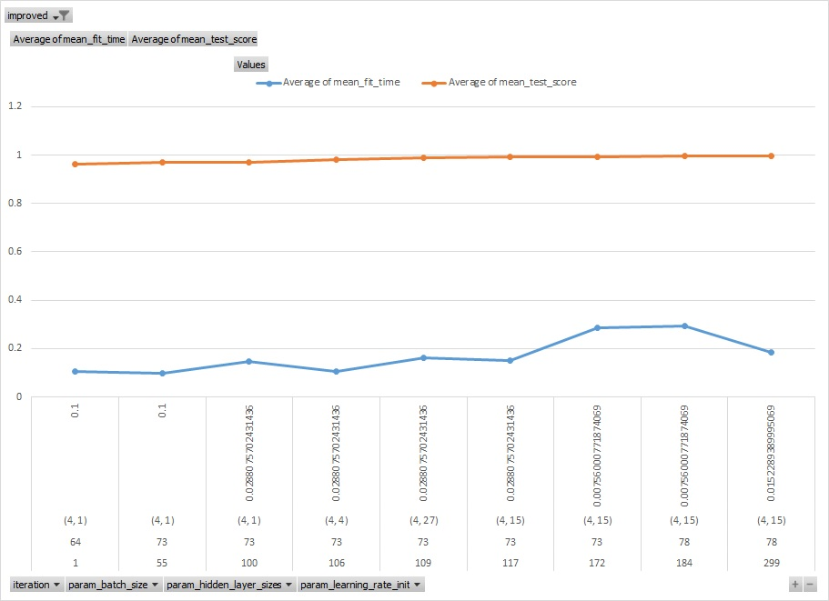

# AutoTune
This is an early stage of a Python implementation of randomized automatic tuning process for model hyper-parameters, intended as a practical support to faciliate typical time-consuming tasks done by modelers to arrive at a model that best describes input data and can generalize well. 

It is upon Scikit-Learn GridSearchCV functinoality, and evolves occasionally as new helpful ideas emerge.

## Background
Currently Scikit-Learn offers two implementation of hyperparameter optimizations - GridSearch, which goes over the entire grid provided, and Randomized Search, which randomly samples each parameter.

However as modelers, we are typically challenged with the task of finding optimal settings, that would lead to greatest model power - among a large multi-dimensional space of hyperparameters, making these search approaches somewhat slow in practice.

Building on how we as modelers would typically navigate this hyperparameter space, this library is intending to facilitate tuning process, allowing computer to iterate in a step-by-step fashion through hundreds of iterations, and allow modelers to analyze and learn from the testing results instead of spending time on triggering multiple tests manually.

## Sample output
Here is a sample Excel output formatted in Excel, including imrovement of model performance ($R^2$) and fitting time.
Note linking Excel spreadsheet to data source could allow you to refresh chart with one click.

Here you can see that that model keeps imroving, taking random incremental steps to achieve 99.6% accuracy navigating parameter space by modifying one parameter at a time. No steps after iteration 299 led to score imrovement above threshold. These steps could also be reviewed in Excel output directly. 

For example, the algorithm tried to extend network architecture by adding additional layers, which did not help imrove performance.

## Future changes 
The following is the list of changes I expect to be useful:

*	Reject model if average fitting time is above threshold, even if model is improving materially
*	Add random parameter/direction selection bias towards what already worked, away from what did not work – depending on model performance score changes
*	Adding preference to models with smaller calibration time, even if performance is similar
*	Capture information of which parameters were modified at each step into calibration history
*	Allow subsequent runs to extend dictionary with new parameters being tuned
*	Allow to adjust new node size in the list via string parameter (min, max, avg, uniform, adj_min, etc.)
*	Allow option to modify more than one [promising] parameter per step, to accelerate learning;
If so, consider to make parameter scale adjustment smaller for those parameters where changes make model worse
*	Work with model / pipeline objects to make results reproducible
* Consider to pptimize each hyperparameter taken via a small grid instead of taking sample step in a random direction

As we can imagine many more functionality could be useful, the intention is for this project to evolve over time to be useful for a larger audience - please reach out if you have any suggestions to changes, or would like to collaborate on one of the changes suggested below.
