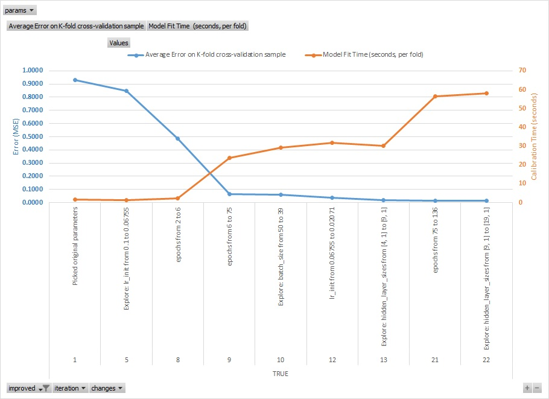

# AutoTune
This is an early stage of a Python implementation of randomized automatic tuning process for model hyper-parameters, intended as a practical support to faciliate typical time-consuming tasks done by modelers to arrive at a model that best describes input data and can generalize well. 

It is inspired by Scikit-Learn GridSearchCV functinoality. 
The intention for this project is to evolve to provide meaningful support to modelers, by combining perspectives of users - who would test current process, suggest ideas and modifications, review and brainstorm suggestions - and contribute to implementation incrementally.

## Background
Currently Scikit-Learn offers two implementation of hyperparameter optimizations - GridSearch, which goes over the entire grid provided, and Randomized Search, which randomly samples each parameter.

However as modelers, we are typically challenged with the task of finding optimal settings, that would lead to greatest model power - among a large multi-dimensional space of hyperparameters, making these search approaches somewhat slow in practice.

Building on how we as modelers would typically navigate this hyperparameter space, this library is intending to facilitate tuning process, allowing computer to iterate in a step-by-step fashion through hundreds of iterations, and allow modelers to analyze and learn from the testing results instead of spending time on triggering multiple tests manually. 

## Sample output
Here is a sample output formatted in Excel, including imrovement of model performance and fitting time.
Note linking Excel spreadsheet to data source could allow you to refresh chart with one click.

Here you can see that that model keeps imroving, taking random incremental steps to achieve 99.6% accuracy navigating parameter space by modifying one parameter at a time. No steps after iteration 299 led to score imrovement above threshold. These steps could also be reviewed in Excel output directly. 

For example, the algorithm tried to extend network architecture by adding additional layers, which did not help imrove performance.

## Recent changes

February, 2018
*	Gave an option to reject the model if average fitting time is above threshold, even if model is improving materially - parameters of such models could be reviewed manually
*	Captured information of which parameters were modified at each step into calibration history
* Allowed string valued hyperparameters, updates to which are governed by param_options_str
* Allowed steps along multiple dimensions, controlled via step_number_vars - this could help accelerate purely random explorative search
* Ensured pseudo-randomization of each step by relying on numpy package functionality, seeded with fraction of system time (share of milliseconds). This should not conflict with model randomization if random state is provided as hyperparameter to the model class during initialization, and later used to re-set corresponding package parameters (e.g. numpy, random, tensorflow) - from within call to model fit procedure
* Facilitated inheritance of results from previous object via supplying existing searcher object as 'prior_results'
* allowed trade-off between incremental performance improvement and calibration time, adding preference to models with smaller calibration time if performance is similar
* **To anticipate performance and time commitment** and avoid trial runs that are not promising, I've meta-learners were added with, by default, linear regression core. These anticipating learners rely on varying parameter vectorization complexity (e.g. based on log transformation of varibales that had a chance to vary and including square terms when three distinct values were observed)
* **adjusted random step selection to prioritize steps anticipated to improve performance trade-off**, allowing to adjust the balance between exploration and exploitation
* augmented results file with additional fields (prior parameters, incremental performance, incremental time)
* passed on extra fit parameters (e.g. number of epochs, batch size) - to gridsearch fit
* shared a Jupyter notebook with an example of applying auto-tune to keras model, after wrapping it in scikit-learn functionality via KerasRegressor class; including an example of tunable call-back usage, which would allow, for example, to terminate model training early to not waste resources, or enable/disable/adjust early stopping settings

## Future changes considered
The following is the list of changes I expect to be useful:
*	Consider to allow subsequent runs to extend results dictionary with new parameters being tuned (assume to be constant for prior runs)
*	Consider to allow removing nodes from lists, and/or add randomness to the new node size
* Consider to make parameter scale adjustment smaller for those parameters where changes make model worse
* Consider to modify anticipator models to predict changes (instead of predicting levels) in performance and fit time, based on changes in vectorized parameters
* Explore ways to adjust batch size for keras over time, helping accelerating training for later epochs
* Prominently save sensitivity analysis - i.e. information of variables, changes in which lead to significant changes in model performance or fitting time
* Consider to adjust anticipator models to either discount-weight early observations, or focus on neighboring points when coming up with reliable linear dependency - note we may want to leverage variables with significant sensitivity when defining distance metric
* Consider valid domain of numeric hyperparameters (currently assumed to be infinite and same-sign)

As we can imagine many much functionality could be useful, the intention is for this project to evolve over time to be useful for a larger audience - please reach out if you have any suggestions to changes, would like to collaborate on one of the changes suggested above, or would really wish for some of them to be implemented soon.
